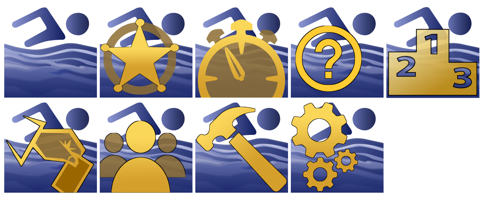

# SCM_Coach
Swimming coaching application. Part of the SwimClubMeet eco system.

Development of this application has just started. Currently there is no releases and it's a work inprogress.

Coach uses shared resources located in the Artanemus/SCM_SHARED repository. (Public)

---
SCM_Coach is a 32bit application written in pascal. It's part of an eco system of applications that makes up the SwimClubMeet project. (SCM lets amateur swimming clubs manage members and run their club night's.)

SCM_Coach accepts data from SCM. Swimmers PBs and race-time data from club-nights can be easy export to SCM_Coach. If the SwimClubMeet database IP address is known to SCM_Coach then data can be move natively across.

CM_Coach uses it own language interpreter (LINT) to extract user text into Work-Outs that have full data tracking. 😉

Analytic data is displayed both visually in charts and can be exported to XLS, PDF or hard copy.

SCM_Coach uses MS SQLEXPRESS. (Many coaches can be running each coaching session.) If you have a club room at your pool, I recommend setting up a DB server and router. Run both SwimClubMeet and the scmCoach database on this system. This will optimism the experience.

Specialized (custom) SQL scripts can be written as the database is not encrypted. You own your data.

As the pace of this project will be a little slower than the other applications I have made for the SCM eco system, all code will be made available. Expect a slow deliver of release 1.0, with many alpha and beta compiles.

An additional support application, SCM_BuildMeCoach, will construct the SQL database.

An additional support application, SCM_UpdateCoach, will update the backend.

These two support applications may initially reside in this repository. And later moved.

If you are a swimming coach and you have thoughts and ideas, I'd be very interested to hear them.

If you are interested in following a developer's blog and track my progress then you can find me at [ko-fi](https://ko-fi.com/artanemus).

---
